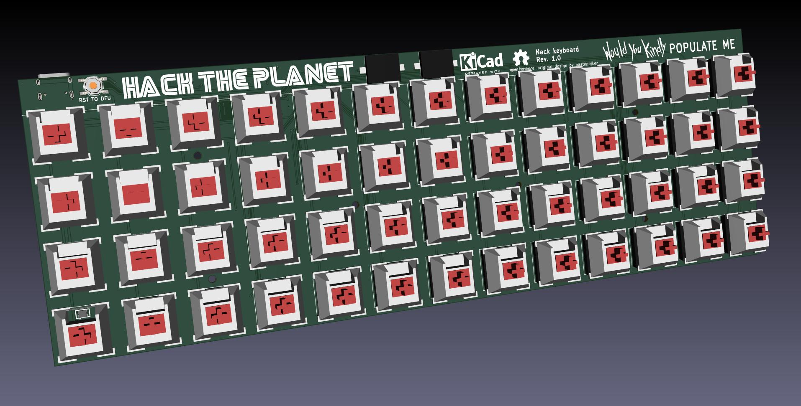

# nack
nack keyboard - uses [**QMK**](https://github.com/qmk/qmk_firmware)  
A ISO-friendly, 13x4 keyboard. It has hardware support for basically all the bells and whistles that qmk can provide!

You like my work? Feel free to donate :)  

